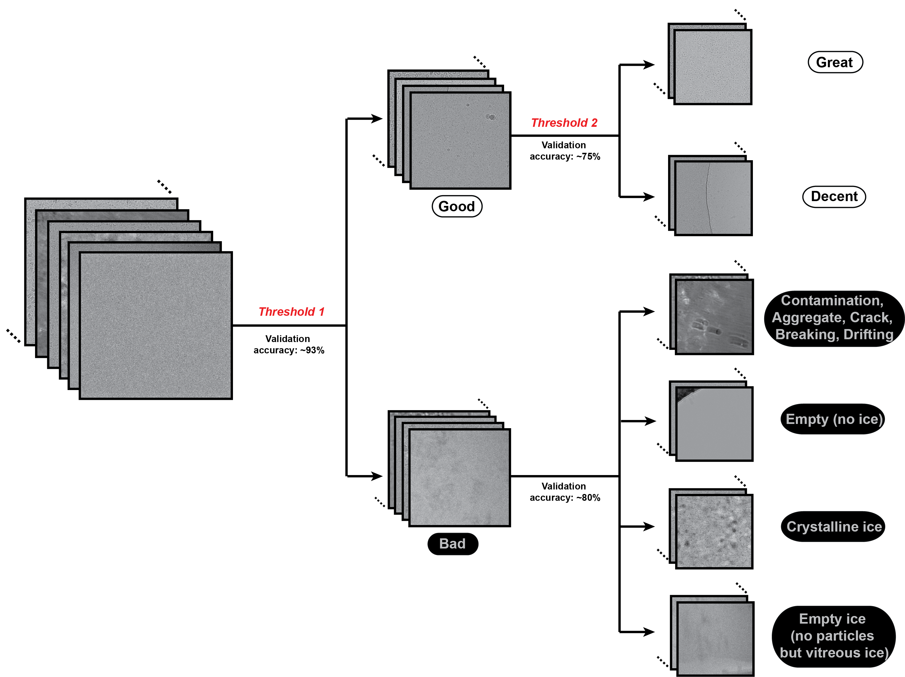

# Automatic-cryoEM-preprocessing
Tools to run user-free preprocessing of cryo-EM datasets: https://www.biorxiv.org/content/10.1101/2019.12.20.885541v1

**Don't want to read the instructions but still want to try it out?**

MicAssess and 2DAssess are incorporated into the freely available for academic research on COSMIC2 science gateway: https://cosmic2.sdsc.edu:8443/gateway/. Just upload your input files and you can run the jobs on the cloud!

**Updates (v1.0.0)**
We have updated cryoassess package to 1.0! MicAssess has a big update whereas 2DAssess is unchanged.

The major change of MicAssess is that it now predicts 6 labels instead of 2. The 6 labels are:
  1. Great
  2. Decent
  3. Contamination, Aggregate, Crack, Breaking, Drifting
  4. Empty (no ice)
  5. Crystalline ice
  6. Empty ice, no particles but vitreous ice

You can find some exemplar images of these 6 labels in the "Examples" folder.

The first two labels are both considered as "good" and will be outputted in a "micrographs_good.star" file. The micrographs in the first "great" label will also be written into a "micrographs_great.star" file. We hope that the "great" label can be helpful to select the most promising micrographs from a big dataset.

The last four labels are all considered as "bad". We hope that MicAssess can not only help with micrographs curation, but also gives the user some information about why this is a "bad" micrograph.

The prediction uses a hierarchical classification model. For a new micrograph, the model will first decide whether this is a "good" or "bad" micrograph (validation accuracy ~93%). The tolerance threshold in this step can be tuned by the user with `--t1`. If the micrograph is classified as "good", the model will further classify whether it belong to the "great" class or "decent" class (validation accuracy ~75%). The tolerance threshold in this step can be tuned by the user with `--t2`. If the micrograph is "bad", the model will further classify which "bad" class it belongs to (validation accuracy ~80%).

MicAssess v1.0 needs new model files, which consist of 4 different .h5 files. Model files can be downloaded per request on https://cosmic-cryoem.org/software/cryo-assess/. For current users, we will just update the files in the shared folder. Please do not change the file names of the models.

Note on 2DAssess: since Relion 4.0 will have its own 2D classification auto-selection tool, we do not plan to update 2DAssess in the future.

**Updates (v0.2.1)**
Credit to @DaniDelHoyo
1. Fixed a bug that caused the malfunction of the prediction results.
2. Now creates a score file as the output that can be used for threshold selection.

**Updates (12/1/2020, v0.2.0)**
1. MicAssess now supports Relion 3.1 star file as the input.
2. Fix requirements dependency issues.

**Note (5/8/2020)**
2DAssess gives syntax error for some users. We have fix the bug and it should be ok to run now.

**Updates (3/7/2020, v0.1.0)**
1. MicAssess now supports micrographs from K3 as well as K2.
2. pip install now enabled. (Credit to @pconesa)
3. MicAssess now can take a single mrc file or any valid glob wildcard as the input. (Credit to @pconesa)
4. MicAssess - now can specify which GPU(s) to use for prediction.

**Installation:**

Both MicAssess and 2DAssess are python based and need anaconda installed to run. Anaconda can be downloaded and installed here: https://www.anaconda.com/distribution/

0. If you have an existing cryoassess conda environment from the previous version, you will need to remove it by
```
conda env remove --name cryoassess
```

1. Create an anaconda environment
```
conda create -n cryoassess -c anaconda -c conda-forge python=3.7 cudatoolkit=11.2 cudnn=8.1
```
2. Activate this conda environment by
```
conda activate cryoassess
```
3. Install cryoassess (this package)
- Navigate to the local path for the installation files to be downloaded with git clone
```
cd /path/to/local/clone
```
- Clone the installation files
```
git clone https://github.com/cianfrocco-lab/Automatic-cryoEM-preprocessing.git
```
- Install
```
pip install path/to/local/clone/Automatic-cryoEM-preprocessing/
```

**Download .h5 model files:**

You will need the pre-trained model files to run MicAssess and 2DAssess. To download them, please go to https://cosmic-cryoem.org/software/cryo-assess/. You will need to fill in a short form, agree the terms and conditions, and we will email you the download link. These pre-trained neural networks are freely available for academic research.

**MicAssess:**

Note: MicAssess currently works on micrographs from both K2 and K3 camera.

You will need to activate the conda environment by ```conda activate cryoassess``` before using MicAssess.

To run MicAssess:
```
micassess -i <a micrograph star file, or any valid glob wildcard for mrc files> -m <model directory>
```

Optional arguments:

`-d`, `--detector`: Either "K2" or "K3". Default is "K2".

`-o`, `--output`: Name of the output directory. Default is MicAssess.

`-b`, `--batch_size`: Batch size used in prediction. Default is 32. Increasing this number will result in faster prediction, if your GPU memory allows. If memory error/warning appears, you should lower this number.

`--t1`: Threshold for good/bad classification. Default is 0.1. Higher number will cause more good micrographs (including great and good) being classified as bad. On the other hand, if you find good micrographs misclassified as bad, try to lower this number.

`--t2`: Threshold for great/decent classification. Default is 0.1. Higher number will cause more great micrographs being classified as good.

`--threads`: Number of threads for conversion. Default is None, using the maximum allowed. If get memory errors, please set it to a reasonable number (e.g. 10). This usually happens when you have super-resolution micrographs from K3.

`--gpus`: Specify which GPU(s) to use, e.g. 0,1,2,3. Default is 0, which uses only the first GPU.

`--dont_reset`: By default, MicAssess will first convert the mrc files to png format before prediction. Depending on your CPU threads and the number of micrographs, this step may be time-consuming. If you already have the mrc files converted (to png) with a previous run of MicAssess, you can skip the conversion step by using this flag.

The input of MicAssess could be a .star file with a header similar to this:
```
data_
loop_
_rlnMicrographName
micrographs/xxxxxxx01.mrc
micrographs/xxxxxxx02.mrc
```
Note that the header must have the "\_rlnMicrographName". The star file must be in the correct relative path so that all the mrc files can be found.

Optionally, input could be a folder where micrographs are, or a pattern where wildcards are accepted. (See https://docs.python.org/3.6/library/glob.html for more details)

MicAssess will output "micrographs_great.star" and "micrographs_good.star" file in the same directory of the input star file. It will also create a MicAssess directory with all the predictions (converted to png), in case you want to check the performance.

Note: if memory warning appears:
(W tensorflow/core/framework/allocator.cc:108] Allocation of 999571456 exceeds 10% of system memory.)
Reduce the batch size by adding ‘-b 16’, or even a smaller number (8 or 4). The default batch size is 32. You can also increase the batch size to a higher number like 64, if your memory allows. Higher batch size is usually faster.

Note on parameter tuning:
 - If you want to keep as many "good" data as possible without worrying too much about some bad data being misclassified as the good ones, you should use a low `--t1` (0.1 or even lower).
 - If you just want to get the "great" data as clean as possible and don't really care about losing some "good/great" data, consider using a higher `--t1` (0.2 ~ 0.5). `--t2` can be leave as default of even higher to be more stringent.

**2DAssess:**
Note: Since Relion 4.0 will have its own 2D classification auto-selection tool, we do not plan to update 2DAssess in the future.

You will need to activate the conda environment by ```conda activate cryoassess``` before using 2DAssess.

To run 2DAssess:
```
2dassess -i <mrcs file outputted by RELION 2D classification> -m <model file>
```
The input of 2DAssess should be an .mrcs file outputted by RELION 2D classification with all the 2D class averages. The name is usually similar to "run_it025_classes.mrcs".
2DAssess will print the indices of the good class averages after the prediction. It will also output predicted 2D class averages into four different classess in the 2DAssess folder. All the class averages are already converted to .jpg files to ease the manual inspection.
